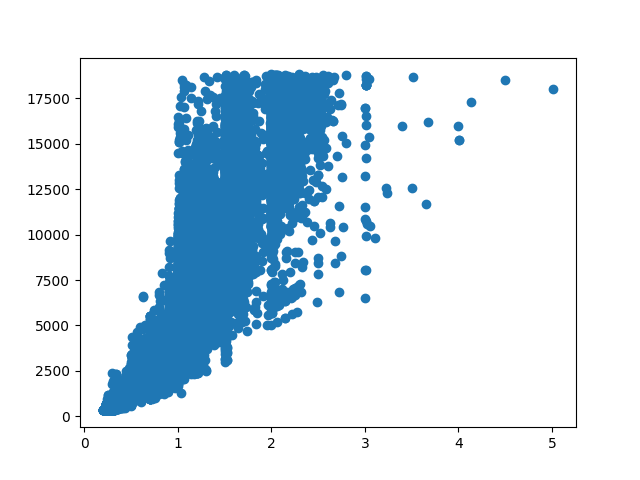
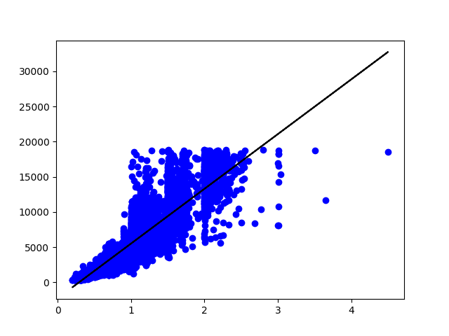

# Linear-Regression-using-sklearn
This is my first project on Machine Learning(Linear Regression using sklearn) to determine the price of diamonds based on the carat information

Dataset: https://www.kaggle.com/datasets/shivam2503/diamonds

This is my first project on a basic machine learning algorithm: Linear Regression to determine the price of a diamond using the carat information. Although the dataset has a lot of other information, for this project I only used one feature set. 

The visualized Dataset here seems to agree that there is a linear relationship in the dataset. 

Now, let us see the line of best fit in the validation data.
